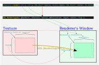
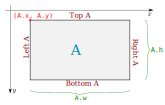
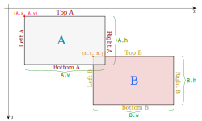
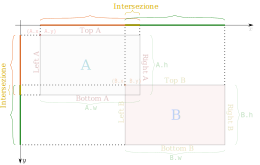
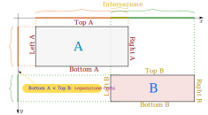
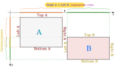
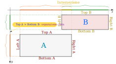
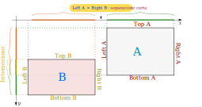

<!-- omit in toc -->
# SDL 2

Repository dedicato agli esperimenti su SDL2, seguendo la guida di [Lazy Foo](https://lazyfoo.net/tutorials/SDL/index.php).

- [Getting Started](#getting-started)
- [Compilazione](#compilazione)
  - [Batch Scripts](#batch-scripts)
    - [`Global_Variables_For_Batch_Files.txt` (Inutilizzato)](#global_variables_for_batch_filestxt-inutilizzato)
    - [`Build.bat`](#buildbat)
    - [`Run.bat`](#runbat)
  - [Make Files](#make-files)
- [Particolarità](#particolarità)
  - [SDL_RenderCopyEx](#sdl_rendercopyex)
- [Assi e Collisioni](#assi-e-collisioni)
  - [A.Bottom < B.Top](#abottom--btop)
  - [A.Rigth  < B.Left](#arigth---bleft)
  - [A.Top    > B.Bottom](#atop-----bbottom)
  - [A.Left   > B.Right](#aleft----bright)
- [Caricamento Textures](#caricamento-textures)
- [Errori da Segnalare](#errori-da-segnalare)
  - [Tutorial 23](#tutorial-23)
- [Tutorial 34](#tutorial-34)
- [Tutorial 41](#tutorial-41)
- [Tutorial 43](#tutorial-43)
- [Tutorial 45](#tutorial-45)
- [Tutorial 46](#tutorial-46)
- [Tutorial 47](#tutorial-47)
- [Tutorial 49](#tutorial-49)
- [Tutorial 50](#tutorial-50)
- [Tutorial 51](#tutorial-51)
- [Tutorial Finite State Machines](#tutorial-finite-state-machines)


## Getting Started

Il sito di Lazy Foo possiede una guida dettagliata su come installare il development kit di SDL2. Questo è il riassunto:

- Scaricare [SDL Development Libraries](http://libsdl.org/download-2.0.php) (versione MinGW).
- Estrarre l'archivio in una cartella a propria scelta.
- Per MinGW-w64, utilizzeremo la versione **x86_64-w64-mingw32** di SDL (non la i686).
- (Facoltativo: in alternativa, usare `Run.bat`, vedi dopo) Inserire nella variabile d'ambiente `PATH` di Windows il percorso al file `x86_64-w64-mingw32\bin\SDL2.dll`.
- In alternativa, è possibile copiare il file `SDL2.dll` nella cartella di progetto.
- Scaricare [l'esempio](https://lazyfoo.net/tutorials/SDL/01_hello_SDL/01_hello_SDL.zip) di Lazy Foo.
- Compilare l'esempio, linkando le librerie di SDL2. In questo *repository*, la cartella `01_Hello_SDL` contiene il *batch script* `Build.bat` con le istruzioni già pronte.
- Il *batch script* `Build.bat` assume che la cartella d'installazione di SDL sia `D:\Dati`. La posizione può essere liberamente modificata nello *script*.
- Lanciare l'eseguibile appena creato, mediante `Run.bat`.

## Compilazione

La compilazione può avvenire sia mediante i *batch script* (opera mia) oppure i *make file* messi a disposizione da Lazy Foo.

### Batch Scripts

I progetti utilizzano dei *batch script* (`.bat`) per la compilazione e l'esecuzione. Questi *batch file* sono stati aggiunti in seguito da me, cioè non sono parte del lavoro originale di Lazy Foo.

#### `Global_Variables_For_Batch_Files.txt` (Inutilizzato)

**ATTENZIONE**: questo metodo non è più utilizzato. Si è trattato di un esperimento interessante, ma a partire dal 30/07/2022 ogni *batch script* è autonomo rispetto a tutti gli altri. Questo per fornire maggiore flessibilità nelle opzioni di compilazione di ogni esempio.

Originariamente era un punto di raccolta centralizzato per tutte le variabili d'ambiente utilizzate nei vari *batch files*, i quali utilizzavano un ciclo `for` per leggere questo *file* di testo e generare automaticamente le variabili d'ambiente. Utile perché se occorreva cambiare una variabile d'ambiente, bastava modificare questo *file*, senza bisogno di toccare i *batch files*.

#### `Build.bat`

Usato per eseguire il processo di *build* di un progetto o esempio.

Usare l'opzione `-c` per eseguire il *clean*.

#### `Run.bat`

Una volta eseguito il *build*, lanciare l'eseguibile con `Run.bat`. Questo *script* aggiunge automaticamente (e temporaneamente) alla variabile d'ambiente `PATH` il percorso alle librerie dinamiche necessarie, come ad esempio `SDL2.dll` o `SDL2_image.dll`.

### Make Files

Mediante il tutorial, Lazy Foo spiega come impostare un minimo `makefile` per compilare un singolo esempio. L'unico elemento diverso tra il `makefile` di Lazy Foo e i miei *batch script* è la rimozione dell'istruzione `-Wl,-subsystem,windows`, la quale sopprime la *console* di Windows durante l'esecuzione di un esempio. La *console* è invece utile in fase di apprendimento e *debugging*.


## Particolarità


### SDL_RenderCopyEx

```c
void LTexture::render( int x, int y, SDL_Rect* SourceClip, double angle, SDL_Point* center, SDL_RendererFlip flip )
```

Il metodo `render` della classe `LTexture` creata da Lazy Foo, riceve:
  - le coordinate `x` e `y` da assegnare alla destinazione
  - `SourceClip`, cioè la porzione di *texture* da utilizzare (`NULL` in caso si voglia utilizzare tutta la *texture*)

All'interno di questo metodo, viene chiamata la funzione di SDL `SDL_RenderCopyEx`, cioè la funzione che esegue il vero e proprio *rendering*:

```c
int SDL_RenderCopyEx(      SDL_Renderer*    renderer,
                           SDL_Texture*     texture,
                     const SDL_Rect*        srcrect,
                     const SDL_Rect*        dstrect,
                     const double           angle,
                     const SDL_Point*       center,
                     const SDL_RendererFlip flip);
```

Questa funzione renderizza una porzione di *texture* in una porzione della finestra di destinazione, gestita dal renderer `renderer`.
`srcrect` e `dstrect` sono entrambi degli `SDL_Rect`, cioè delle strutture che rappresentano dei rettangoli, composte dai campi `x`, `y`, `w` e `h`. I campi `x` e `y` rappresentano la posizione rispetto all'angolo in alto a sinistra, mentre `w` e `h` sono le dimensioni in larghezza e altezza, rispettivamente nel caso della *texture* e nel caso della finestra su cui renderizzare.

Gli argomenti passati ai parametri `x` e `y` di `LTexture::render` vengono poi passati a `dstrect`. Larghezza e altezza di `dstrect` vengono copiati da `SourceClip.x` e `SourceClip.y`. In caso `SourceClip` sia `NULL`, cioè vogliamo usare l'intera *texture*, larghezza e altezza passate a `dstrect` sono `mWidth` e `mHeight`, cioè le dimensioni originali della *texture* intera.



## Assi e Collisioni

In SDL, l'asse $y$ è rovesciato rispetto al consueto piano cartesiano. Tuttavia, continuiamo a mantenere l'orientamento tradizionale quando indichiamo la parte superiore o inferiore di una forma, ad esempio un rettangolo, così come indicato in figura:



In questo esempio, possiamo notare una collisione tra due rettangoli:



La collisione si verifica quando nessuna delle proiezioni di `Left`, `Right`, `Top` o `Bottom` dei due rettangoli è separata.



Affinché ci sia una collisione, è necessario che non ci sia separazione né sull'asse x né sull'asse y, ovvero devono esserci delle intersezioni su entrambi gli assi. Il modo più semplice ed elegante di verificarlo è di partire dall'ipotesi che ci sia stata una collisione, e tentare di confutarla eseguendo in sequenza i quattro test di separazione:

```cpp
A.Bottom < B.Top
A.Rigth  < B.Left
A.Top    > B.Bottom
A.Left   > B.Right
```

Una qualsiasi delle condizioni qui sopra assicura che i due rettangoli siano separati almeno su un asse.

### A.Bottom < B.Top



### A.Rigth  < B.Left



### A.Top    > B.Bottom


### A.Left   > B.Right


## Caricamento Textures

A partire da SDL 2.0, le *textures* possono essere caricate direttamente da un *file* immagine, senza passare tramite una superficie per poi convertire la superficie a *texture*. Anziché usare `IMG_Load` e `SDL_CreateTextureFromSurface`, usiamo direttamente `IMG_LoadTexture`. È richiesto l'utilizzo del modulo `SDL_image`.

```cpp
#include <SDL.h>
#include <SDL_image.h>

SDL_Texture* newTexture = IMG_LoadTexture( Renderer, "PicturePath" );
```

## Errori da Segnalare

### Tutorial 23

- "acccessor"

## Tutorial 34

- In un commento del codice, "Recieved" invece che "Received".

- Nel tutorial online, "dissapoint" al posto di "disappoint".

## Tutorial 41

- In un commento del codice, "rectanges" invece che "rectangles".

## Tutorial 43

- Nel codice (terza riga), `and,`.

## Tutorial 45

- Errore: reinterpret_cast from type 'const char*' to type 'void*' casts away qualifiers

```C++
SDL_TimerID timerID = SDL_AddTimer( 3 * 1000, callback, reinterpret_cast<void*>( "3 seconds waited!" ) );
```

## Tutorial 46

- Errore: cast from 'void*' to 'int' loses precision [-fpermissive]

```C++
printf( "Running thread with value = %d\n", (int)data );
```

- Nel tutorial online, "need to declared" al posto di "need to be declared".

- Un commento nel codice: `// Remove timer in case the call back was not called`. Probabilmente un copia-incolla dal tutorial precedente.

## Tutorial 47

- Nel tutorial online, "there no guarantee" al posto di "there **is** no guarantee".

## Tutorial 49

- Nel tutorial online, "conditons" al posto di "conditions".

## Tutorial 50

- Nel tutorial online si dice che il `readme.txt` contiene le librerie contro cui linkare, ma ciò non risponde a verità. Nel mio caso, avevo bisogno di linkare contro `OpenGL32.Lib` e `GlU32.Lib`.

## Tutorial 51

- Nel tutorial online, "gets rid off al" dovrebbe essere "gets rid of all"?

## Tutorial Finite State Machines

- Nel tutorial online: "they declared".
- Nel tutorial online: "we'll managing globally".
- Nel tutorial online: "Our enter()/exit() function basically do" (plurale).
